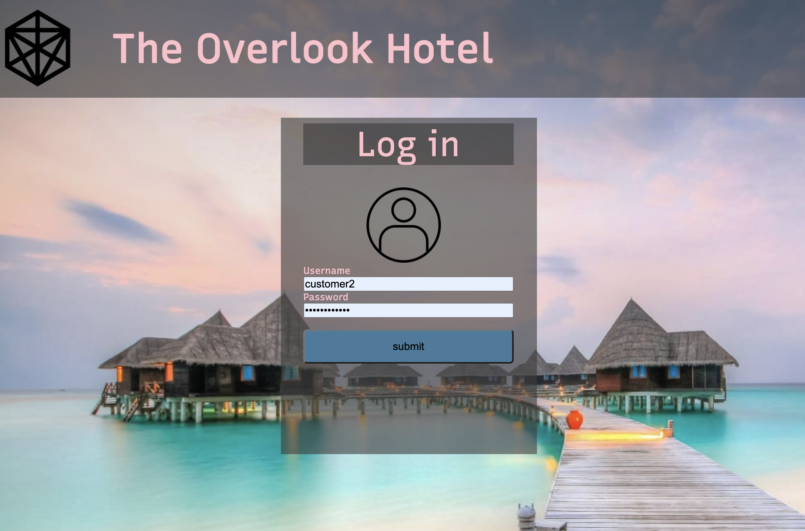
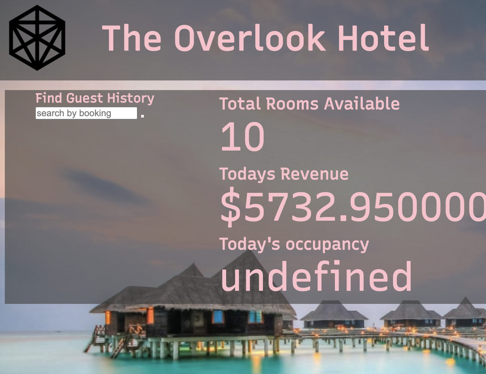
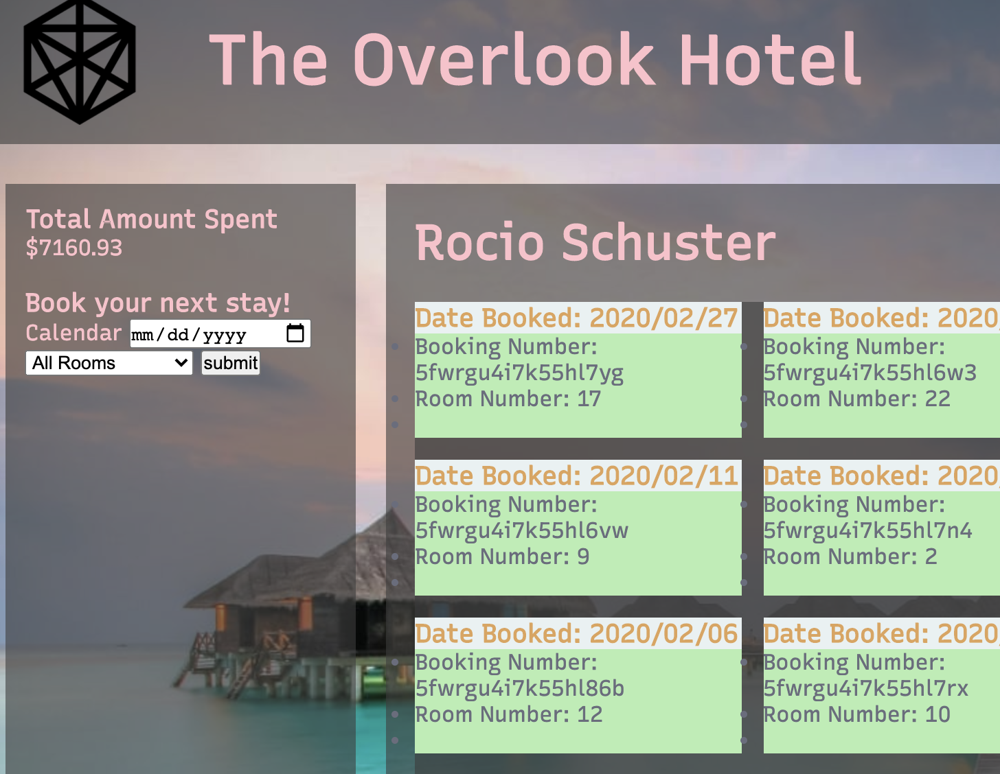
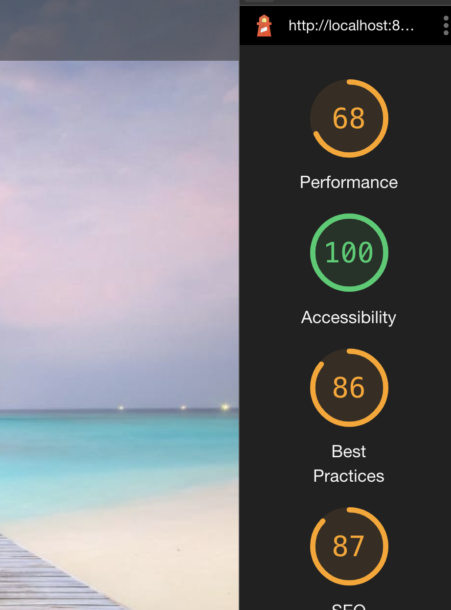

# Overlook 
Mod 2 Solo Project for 2005 FE, Turing School of Software & Design

### Developers
Linus Leas

### Project Links
- [Repo](https://github.com/Leasw144/overlook)
- [Project Board](https://github.com/Leasw144/overlook/projects/3)
- [Project Spec](https://frontend.turing.io/projects/overlook.html)

## Abstract
This project seeks to create an app from the ground up that tracks a hotels bookings, revenue, and occupancy, and allows guests at this hotel to find previous bookings and make future ones.

Current MVP is as follows:
  * Managers can log in and view the following:
    - the days revenue, 
    - number of rooms available, 
    - percentage of rooms taken
  * Guests can log in under a unique User name and find:
    - total amount spent at this hotel
    - all bookings that have been made in order from most recent to earliest

## How to get started


1. Clone down this repo, you can use an optional argument when you run git clone (you replace the [...] with the terminal command arguments): git clone [remote-address] [what you want to name the repo]
2. Remove the default remote: git remote rm origin (notice that git remote -v not gives you back nothing)
3. Create a new repo on GitHub with the name of [what you want to name the repo] to be consistent with naming
4. Copy the address that you would use to clone down this repo - something like git@github.com:...
5. Add this remote to your cloned down repo: git remote add origin [address you copied in the previous step] - do not include the brackets
6. Now try to commit something and push it up to your new repo. If everything is setup correctly, you should see the changes on GitHub.
7. Once you have cloned the repo, change into the directory and install the project dependencies by running npm install.
8. To verify that it is setup correctly, run `npm start` in your terminal. Go to `http://localhost:8080/` to interact with the application. Enter `control + c` in your terminal to stop the server at any time.

## How to View Your Code in Action

In the terminal, run:

```bash
npm start
```

You will see a bunch of lines output to your terminal. One of those lines will be something like:

```bash
Project is running at http://localhost:8080/
```

Go to `http://localhost:8080/` in your browser to view your code running in the browser.

---

## Reflections/Progression
I knew off the bat there were obvious gaps in my knowledge that would slow me down during the project, namely, fetching but also dealing with webpack and how it carries information over. 

With these gaps in knowledge, and given the short nature of the project, I struggled balancing research vs. implementation. For example, do I spend time watching a 30 minute video on Youtube about Inheritance or should I just get my hands dirty and start throwing code at the wall? The result was somewhere inbetween with me being anxious while reading or watching material that was not yet useful, or being anxious on why the code wasn't working. 

The main hang up I had however was just the general confusion of where and when my instaniations were happening. For a solid day a half, I wasn't sure if my variables were globally scoped and continuing on seemed impossible with the data and by Sunday, I was already so far behind that getting anywhere meaningfully was a long shot. 

It wasn't until Monday I was able to get a clearer grasp of what was happening which resulted in a flow I could get into, though, in a very slipshod manner. I learned a lot but much of it was like stumbling in the dark. With a better understanding of the given technologies, I believe I could bring in a comparably better project considering Monday was when progress really started happening for myself.

### Known Issues
* There was an attempt at spies very late into the game but considering how difficult it was for the rest of the cohort, as of now, Spies implementation has been put on the back burner, 
* Some tests, and especially Hotel-test, is currently failing due to how the mock data is set up, figuring out how to accurately represent the data proved too much work with the time given. For the other test files, there simply wasn't enough time to properly vet and confirm their functionality officially.
* Guests can currently view past bookings but they cannot book at this point in time. Given future iterations, that feature could probably be implemented; some code was started but ultimately left as is.
* While Lighthouse has given the app an accessibility rating of 100, media queries have been left out of the project.
* The site is really ugly.

### Images
Logging in

<br>
Manager Display

<br>
Guest Display

<br>
Lighthouse Score



### Special Thanks 
- Leigh Larson
- Josh Sevy
- Steph Norton 
- Ophus Wong
- Kyle Wong (no relation!)


